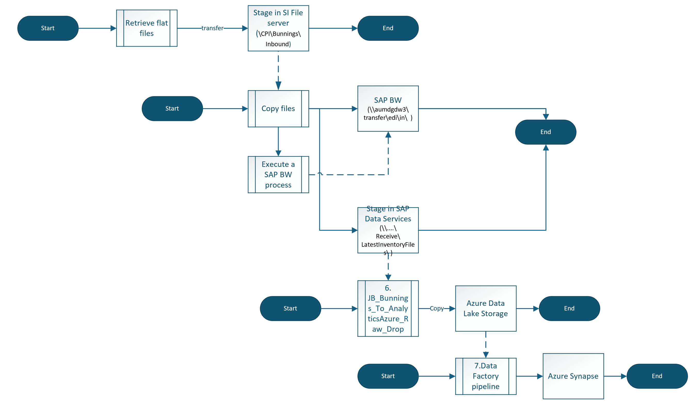
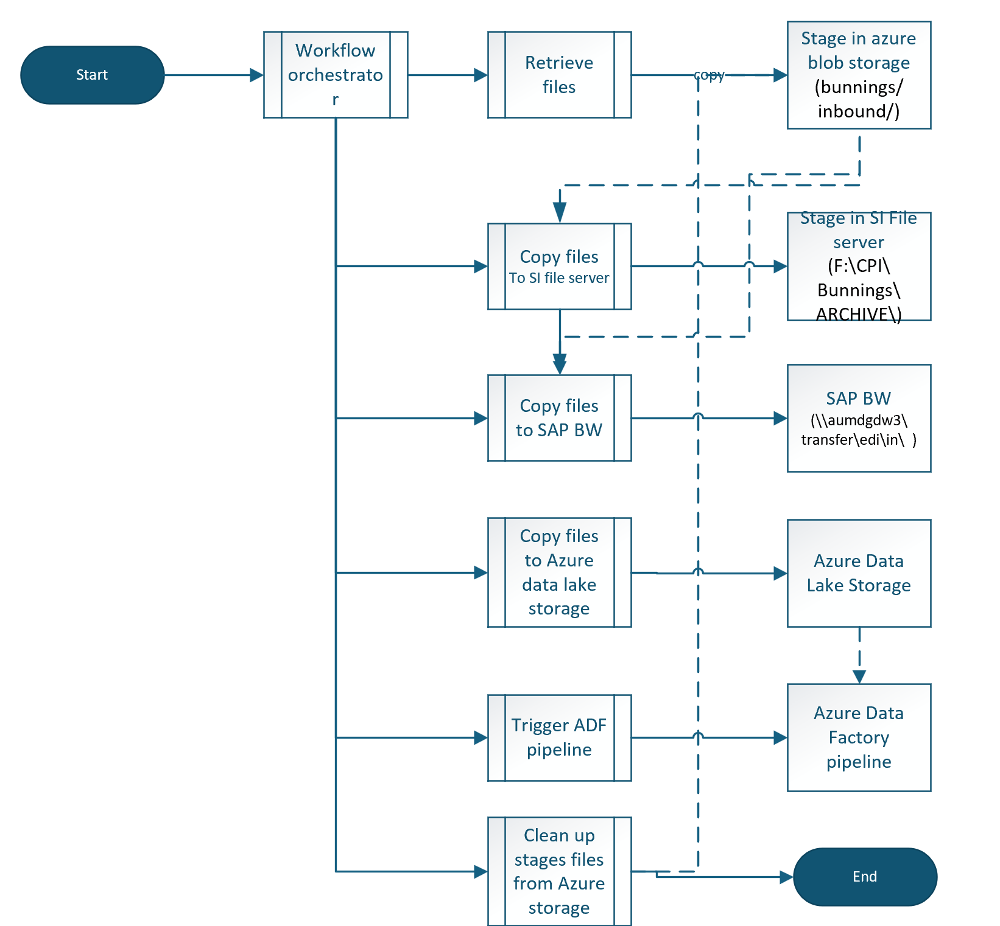
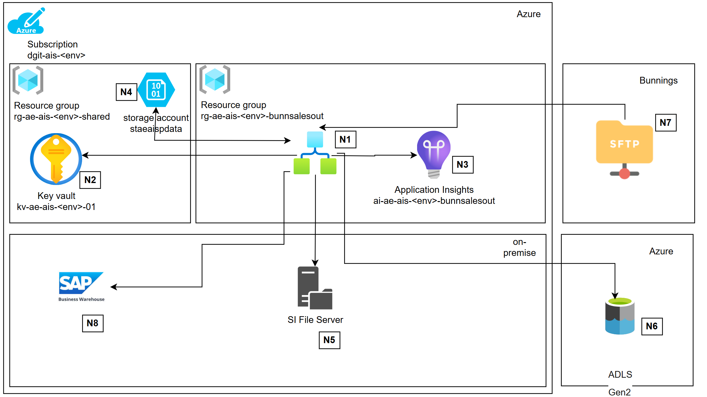
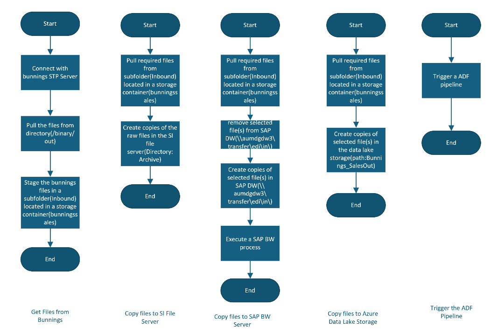

# Business Context
Bunnings makes up a large portion of Dulux's retail sales channel and is integrated with Dulux business systems via a process chain to provide weekly sales reports. This set of workflows ingest the flat files that Bunnings provides to Dulux into the necessary downstream systems. 

 

# Source and Target Systems

Solution Component | Description | Remarks
------ |--------- | ------
Bunnings SFTP server| Hosting server that contains the sales reports to be fetched by Dulux | This is the **source systems** and enforces 'Dual auth with basic and key exchange'.
SI file server | This is the Dulux SFTP server that also acts as the file server for Dulux | All incoming files are staged here and copied across to downstream system including Local file archive, SAP Data Services server, SAP BW.
SAP Data Services | This process initialises a list of available files located in directory 'Receive\LatestInventoryFiles\' and loads those into an Azure Data Lake.  | This process exists due to an issue Dulux were facing connecting to the Azure storage account in question, and the Data Services tool was able to overcome that with a native driver included in the software package.
Data Engineering pipeline | This is a Azure Data Factory(ADF) that picks up the Bunnings file from the drop folder(\Bunnings_SalesOut) into Azure data lake. This pipeline orchestrates the Bunnings file, and pushes the data to the Curated layer/in synapse views. | 

 

# Assumptions
- Data provided as flat files from Bunnings, no filtering or transformations are required on the raw files.
- Files are received from the Bunnings at the same time(7:30pm) every day.
- The files are received in the same format each run and no extraneous files are received during pickup.
- The ADF pipeline runs on a schedule.
- No file needs to be saved as backup files in the SI file server(Path: 'F:\integrator\EDI\receive\backup\bunnings')
- The process running in the 'SAP Data Services platform' will be removed since Logic app will copy the required files from the staged location(i.e. azure storage account residing in the Integration Landing Zone) straight to the Azure data lake storage Gen2 storage account.

 

# Current State
## Logical Design

<ins>Key highlights<ins>:

- Dual auth with basic and key exchange is in use in the SFTP connectivity between bunnings SFTP server and SAP Integration flow.
- Basic auth is in use in the SFTP connectivity between SAP Integration flow and Dulux SFTP server(which is also the SI file server).
- The SI file server acts as the staging storage to faciliate file ingestion to the downstream business systems. It also retains the raw files as backup and archive.
- The overall process consists in multiple isolated sub-processes that perform file movements from the SI file server to different internal target systems.
- A powershell script runs in the SI file server that performs the file copy activity to the target business and data systems. It also triggers a job on the SAP BW system.

 

# Target State
## Logical Design

<ins>Key highlights:<ins>

- A timer triggered workflow will start the chain of execution and orchestrate the data movement process via nested workflows:
  - The 'Retrieve files' workflow will pull in the files from bunnings SFTP and stage those in azure blob storage.
  - The 'Copy files to SI file server' will copy all the staged files from blob storage and put the same in the SI File server as archive file (path: 'F:\CPI\Bunnings\ARCHIVE\').
  - 'Copy file to BW system' will pull in the required set of files to SAP Business warehouse(BW) system and will triggers the designated SAP BW job via power shell script.
  - 'Copy file to Azure Data Lake Storage' will copy the files into Azure Data Lake storage.
  - 'Trigger ADF pipeline' workflow will invoke a ADF pipeline
  - Finally, a workflow will clean up the stages files from the blob storage.
- The logic app will connect with Azure Data Lake Storage Gen2 (ADLS Gen2) account by [Azure Blob Storage connector](https://learn.microsoft.com/en-us/connectors/azureblob/) 
- Logic app will use 'File System built-in connector' to connect with the on-premises file shares.
- Logic app will use office365 connector to send emails from b2b.support@duluxgroup.com.au.

<ins>Note: </ins>
 - Some of the nested workflows can be run in a sequence or in parallel dependending on the requirement. This can be discussed in detail during the implementation stage.
 - We will use the Logic Apps PowerShell action to run a PowerShell script that calls the '.bat' file on the SI file server.

 

# Physical Design

## Resource Details

Reference | Component | Description 
------ | ------ | ------
N1 | Logic App | Logic app will be deployed in a new resource group. This will retrieve secrets (that are required for authorization with bunnings SFTP and SI file server) from the shared key vault (see N2). It will host different set of workflows to perform the 'copy file' activities to different target systems e.g. SI file server(see N5), SAP BW(see N8) and Azure data lake storage(see N6). The Logic app will use application insights resource (see N3) for logging and monitoring. 
N2 | Key Vault  | Key vault shared by all integrations on the integration platform, expected to be used by logic app (see N1) for storing(and retrieving) secrets.
N3 | Application Insights | Dedicated application insights resource used for monitoring of the logic app (see N1). Expected to be used for logs, metrics, and alerting.
N4 | Azure blob Storage | It will be used as the staging storage where incoming files from Bunnings SFTP (see N7) will be fetched by the one logic app workflow (see N1)
N5 | SI File Server | This acts as the persistent storage for Dulux where the raw files received from Bunnings SFTP are stored.
N6 | Azure Data Lake Storage| Incoming files from bunnings are also pushed to this storage by another logic app workflow(see N1). These files are then picked up by data pipelines that pushes the data to the Curated layer/in synapse views. 
N7 | Bunnings SFTP Server | This is the source system that publishes the sale reports in an SFTP location path. This server is operated by Bunnings and only vetted systems are granted access to it.

 

## Integration Workflows
Following diagram illustrates the set of actions that will be orchestrated by the parent logic app workflow:

 

## Access and permission Requirement
- Access to the mailbox: b2b.support@duluxgroup.com.au.

  - A service account will need to be created and a compatible office365 license needs to be assigned.
- The managed identity of the Logic app needs to be granted required 'Role Based Access Control'(RBAC) permission to the azure data lake storage account.
- The managed identity of the Logic app needs to be granted required 'Role Based Access Control'(RBAC) permission to execute a pipeline in the existing ADF.
- 

 

## Connectivity Requirement

### Connectivity Requirement for DEVELOPMENT Environment
Source System | Source IP | Destination System| Destination IP| Destination Port | remarks
------ | ------ | ------| ------| ------ | ------
Logic App| *\<ase subnet>* | Bunnings SFTP server | *\<To be confirmed >* | *\<To be confirmed by Dulux>* 
Logic App| *\<ase subnet>* | Dulux SFTP server | *\<To be confirmed >* | 22
Logic App| *\<ase subnet>* | Dulux SI File server | *\<To be confirmed >* | 445 *\<To be confirmed by Dulux>* 
Logic App| *\<ase subnet>* | SAP BW server | *\<To be confirmed >* | *\<To be confirmed by Dulux>* 
Logic App| *\<ase subnet>* | Azure Data Lake Storage Account | *\<To be confirmed >* | 443 | 

 

### Connectivity Requirement for TEST Environment
Source System | Source IP | Destination System| Destination IP| Destination Port | remarks
------ | ------ | ------| ------| ------ | ------
Logic App| *\<ase subnet>* | Bunnings SFTP server | *\<To be confirmed >* | *\<To be confirmed by Dulux>* 
Logic App| *\<ase subnet>* | Dulux SFTP server | *\<To be confirmed >* | 22
Logic App| *\<ase subnet>* | Dulux SI File server | *\<To be confirmed >* | 445 *\<To be confirmed by Dulux>* 
Logic App| *\<ase subnet>* | SAP BW server | *\<To be confirmed >* | *\<To be confirmed by Dulux>* 
Logic App| *\<ase subnet>* | Azure Data Lake Storage Account | *\<To be confirmed >* | 443 | 

 

### Connectivity Requirement for Production Environment
Source System | Source IP | Destination System| Destination IP| Destination Port | remarks
------ | ------ | ------| ------| ------ | ------
Logic App| *\<ase subnet>* | Bunnings SFTP server | *\<To be confirmed >* | *\<To be confirmed by Dulux>* 
Logic App| *\<ase subnet>* | Dulux SFTP server | *\<To be confirmed >* | 22
Logic App| *\<ase subnet>* | Dulux SI File server | *\<To be confirmed >* | 445 *\<To be confirmed by Dulux>* 
Logic App| *\<ase subnet>* | SAP BW server | *\<To be confirmed >* | *\<To be confirmed by Dulux>* 
Logic App| *\<ase subnet>* | Azure Data Lake Storage Account | *\<To be confirmed >* | 443 | 

 

## Security
-  Only required access will be granted to the logic app over the azure data lake storage account, Azure data factory and the file server(to execute the SAP BW process).
- The bunnings sales files will be removed once the data ingestion is complete. Or, there can be a logic app workflow that will clean up the files after 'N' number of days from the date these were created.

## Identity
- Managed identity will be used to access azure resources e.g. Azure Data Lake Storage and ADF pipeline.

 

# References
- [Connect to on-premises file systems from workflows in Azure Logic Apps](https://learn.microsoft.com/en-us/azure/connectors/file-system?tabs=consumption)
