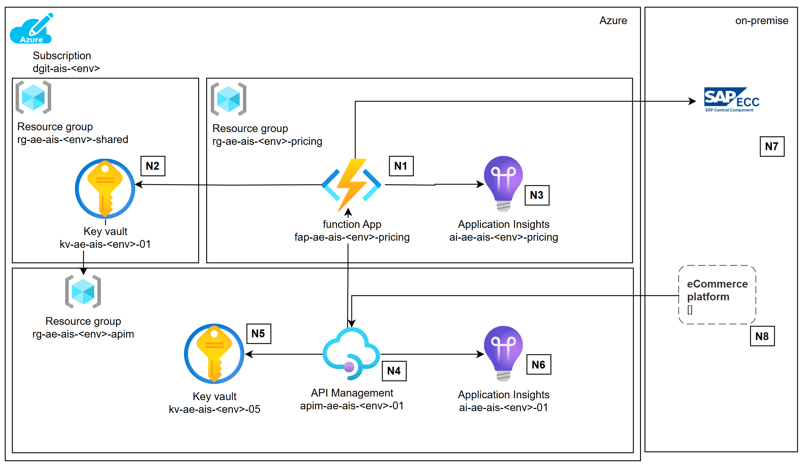
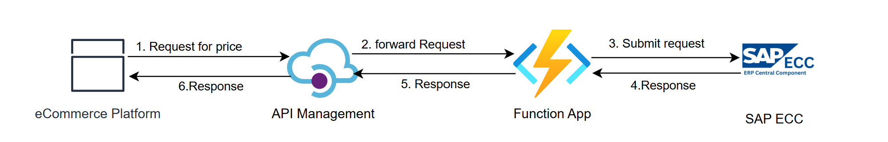
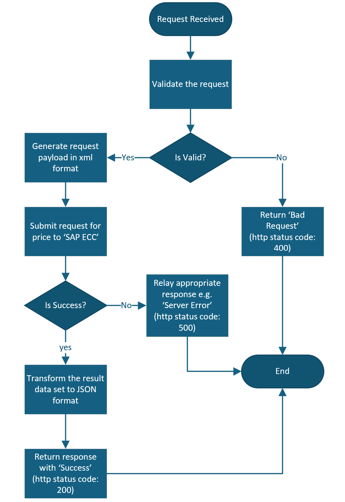

# Business Context
The ECC get pricing integration provides live pricing information to the Dulux e-Commerce platforms. This information sits with the Dulux ERP platform which can simulate the price in the pricing engine, and pass back the calculated value in the response body back to the requesting system. 

 

# Source and Target Systems

Solution Component | Description | Remarks
------ |--------- | ------
e-Commerce Platforms|These are Dulux e-Commerce platforms that need live pricing information | These are the **source systems**.
SAP Integration Process | Hosts the integration flows that processes the incoming requests, transform those and get the requested pricing information from SAP ECC | This system **abstracts** the target system from the source system.
SAP ECC | This is the Dulux ERP system that hosts data related to materials and pricing. It exposes a web service that returns pricing information. | This is the **target system**

 

# Assumptions
- No legacy 'Authorizations' and/or 'Authentication' are in use in relation to this Integration.
- Basic Authentication is in use between the e-Commerce platforms and the SAP Integration process.
- Basic Authentication is in use between the SAP Integration process and SAP ECC.
- All systems(both source and target systems) are located on-premise.
- All communications among the systems are server-to-server communication.
- The SAP ECC accepts requests in xml format over a odata webservice API.
- e-Commerce platforms submits the request in JSON format.
- All transactions is secured in transit i.e. protected by https protocol and is used in every communication between any two systems in relation to this integration.
- Number of requests to the *GetPricing* is ~ 3000 per second in the peak period.

 

# Current State
## Logical Design

<ins>Key highlights<ins>:

- The integration layer acts as a layer of abstraction to this process ensuring the call to the ERP system is formatted correctly.
- The request body that is submitted by e-Commerce platform gets transformed into XML payload before the request is submitted to the web service hosted on the SAP ECC system.
-  Response from the oData service is XML based which is tranformed back into JSON before the response is returned back to the source i.e. e-Commerce platform.

 

# Target State
## Logical Design

<ins>Key highlights:<ins>

- The integration process that is currently hosted in the SAP integation platform, will be replaced by a new API that will be hosted in the Dulux Enterprise Integration platform(powered by Azure Integration Services). 
- This API will be the backend that will be abstracted by a API gateway. 
- Dulux e-Commerce platforms will need to switch to a new endpoint that will be published by the API gateway. This new endpoint will not be accessible from outside of Dulux network. 
- There will be no change in the authentication and/or authorization process(unless mandated by Dulux), request and response schema definitions to make the migration *transparent*.

 

# Physical Design

## Resource Details

Reference | Component | Description 
------ | ------ | ------
N1 | Function App | Function app will be deployed in a new resource group. This will retrieve secrets (that are required for authorization) from the shared key vault (see N2). The Function app will use application insights resource (see N3) for logging and monitoring. It will host a function called 'GetPricing' that will validate the request body and orchestrate calls to the webservice that is hosted in SAP ECC(see N7)
N2 | Key Vault  | Key vault shared by all integrations on the integration platform, expected to be used by function app (see N1) for storing(and retrieving) secrets.
N3 | Application Insights | Dedicated application insights resource used for monitoring of the function app (see N1). Expected to be used for logs, metrics, and alerting.
N4 | API Management | APIM will abstract the backend systems from the e-Commerce Platforms (see N8)
N5 | Key Vault | Key vault dedicated to API management (see N4). This will be use for storing credentials if APIM needs to manage the authorization with SAP ECC. APIM will get the function app key from this keyvault.
N6 | Application Insights | Application insights dedicated to API management (see N4). Expected to be used for logs, metrics, and alerting.
N7 | SAP ECC | ERP platform that generates the price information.
N8 | e-Commerce Platform | Source system that requests for the price data.

 

## Data flow

Following diagram highlights the data flow:

 

## Integration Workflows
Following diagram illustrates the set of actions that will be orchestrated by the backend function app:

 

## Connectivity Requirement

### Connectivity Requirement for DEVELOPMENT Environment
Source System | Source IP | Destination System| Destination IP| Destination Port
------ | ------ | ------| ------| ------
e-Commerce Platforms| *\<To be confirmed by Dulux>* | APIM gateway | *\<To be confirmed >* | 443
Function App | *\<ase subnet>* | SAP ECC | *\<To be confirmed by Dulux>* | *\<To be confirmed by Dulux>*

### Connectivity Requirement for TEST Environment
Source System | Source IP | Destination System| Destination IP| Destination Port
------ | ------ | ------| ------| ------
e-Commerce Platforms| *\<To be confirmed by Dulux>* | APIM gateway | *\<To be confirmed >* | 443
Function App | *\<ase subnet>* | SAP ECC | *\<To be confirmed by Dulux>* | *\<To be confirmed by Dulux>*

### Connectivity Requirement for PRODUCTION Environment
Source System | Source IP | Destination System| Destination IP| Destination Port
------ | ------ | ------| ------| ------
e-Commerce Platforms| *\<To be confirmed by Dulux>* | APIM gateway | *\<To be confirmed >* | 443
Function App | *\<ase subnet>* | SAP ECC | *\<To be confirmed by Dulux>* | *\<To be confirmed by Dulux>*

 

## Security
- Access to the function app will be secured by 'function app key' and will be accessed by API Management only.
- The function app key(required by the API Management) will be stored as a secret in the APIM keyvault.
- All the secrets (e.g. credentials required for authorizations with SAP ECC) will be stored as secrets in the shared keyvault.
- The Integration backend API(i.e. function app) will generate Authorization header that needs to be supplied to the target business system(e.g. SAP ECC) leveraging the credentials as stated above.
- Pricing data or any other sensitive data will not be stored in the integration platform.
- To ensure only requests that are originated from eCommerce platforms, the source IPs will need to be whitelisted on the API policy in APIM leveraging policy[Restrict caller IPs](https://learn.microsoft.com/en-us/azure/api-management/ip-filter-policy).

## Future Recommendation

### Security
It is recommended to strengthen the authorization process that Dulux currently has in place to improve the security posture. However this is for future consideration and is subject to feasibility check from the e-Commerce platforms and SAP ECC side.

 - Please refer to [Authentication and authorization to APIs in Azure API Management](https://learn.microsoft.com/en-us/azure/api-management/authentication-authorization-overview). Scenario 2 seems to be most applicable in this context.
 - Microsoft recommends using a subscription (API) key in addition to another method of authentication or authorization.

 

### Data Caching
Dulux can assess a potential opportunity in caching the pricing data in case the price does not change that often(i.e. every 10 min or so). In that case we can cache the price in APIM in-built cache for a period that the price are valid for. This will reduce the incoming traffic to SAP ECC.

## Identity
Not applicable based on the current authorization process.
