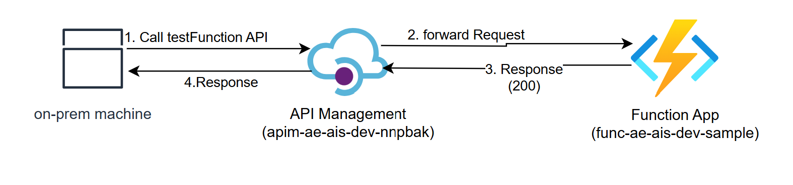

# Sample Integration

The Logic App and Function are pre-configured to be deployed to the Insight Path Dev environment.

This integration is comprised of a backend function app that simply returns a response with http status code: 200.

This API endpoint can be accessed from on-premise system by https://apim-ae-ais-dev-nnpbak.azure-api.net/integration/sample/v1/testfunction

Notes:
- The resources for this dummy integration have been created in this resource group: rg-ae-ais-dev-sample.
-  To make the testing easy and simple, we have not enforced any authorization
- the 